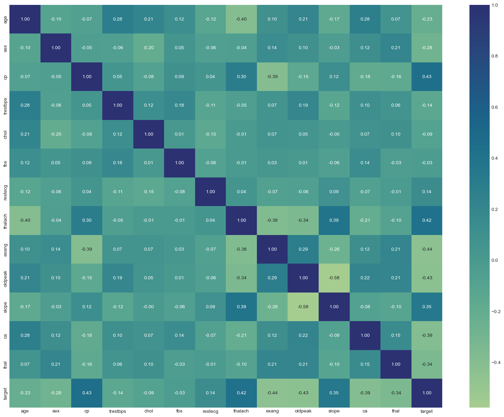
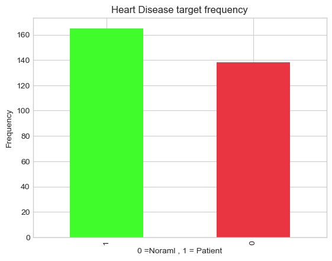
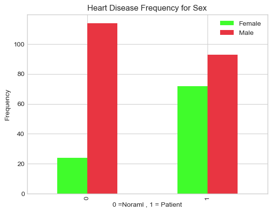
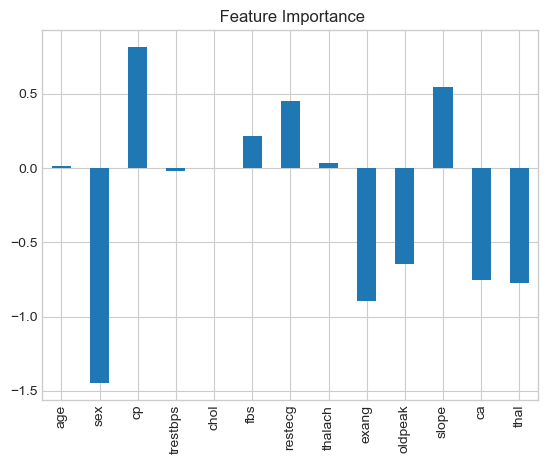

# Heart Disease Classification

[](https://opensource.org/licenses/MIT)
[](https://www.python.org/downloads/)

Machine learning model to predict heart disease based on clinical parameters. Developed as part of Udemy's Complete Machine Learning & Data Science Bootcamp.

## Problem Definition
> Given clinical parameters about a patient, can we predict whether or not they have heart disease?

## Dataset
- **Source**: UCI Machine Learning Repository (Cleveland data)
- **Kaggle**: [Heart Disease Classification Dataset](https://www.kaggle.com/datasets/sumaiyatasmeem/heart-disease-classification-dataset)
- **Samples**: 303
- **Features**: 13 clinical attributes
- **Target**: Presence of heart disease (1 = yes, 0 = no)

### Feature Dictionary
| Feature    | Description                                                                 |
|------------|-----------------------------------------------------------------------------|
| age        | Age in years                                                                |
| sex        | Gender (1 = male; 0 = female)                                               |
| cp         | Chest pain type (0-3)                                                       |
| trestbps   | Resting blood pressure (mm Hg)                                              |
| chol       | Serum cholesterol (mg/dl)                                                   |
| fbs        | Fasting blood sugar > 120 mg/dl (1 = true; 0 = false)                       |
| restecg    | Resting electrocardiographic results (0-2)                                  |
| thalach    | Maximum heart rate achieved                                                 |
| exang      | Exercise induced angina (1 = yes; 0 = no)                                   |
| oldpeak    | ST depression induced by exercise relative to rest                          |
| slope      | Slope of peak exercise ST segment (0-2)                                     |
| ca         | Number of major vessels colored by fluoroscopy (0-3)                        |
| thal       | Thallium stress result (1,3,6,7)                                            |
| target     | Presence of heart disease (1 = yes; 0 = no)                                 |

## Approach
1. Exploratory Data Analysis (EDA)
2. Data visualization and feature analysis
3. Model comparison:
   - Logistic Regression
   - K-Nearest Neighbors (KNN)
   - Random Forest Classifier
4. Hyperparameter tuning (GridSearchCV, RandomizedSearchCV)
5. Model evaluation using cross-validation
6. Feature importance analysis

## Results
Best model: **Logistic Regression** with tuned hyperparameters
- **Accuracy**: 80.3%
- **Precision**: 82%
- **Recall**: 87%
- **F1-score**: 85%
- **Cross-validated Accuracy**: 81.8%

## Key Findings
- Chest pain type (cp) is the strongest predictor of heart disease
- Exercise-induced angina (exang) and ST depression (oldpeak) are significant negative indicators
- Maximum heart rate (thalach) shows strong positive correlation with target
- Age has moderate negative correlation with heart disease

## Visualization Examples

### Feature Correlation


### Class Distribution


### Gender Analysis


### Predictive Features


## Requirements
- Python 3.8+
- Libraries:
  ```text
  numpy
  pandas
  matplotlib
  seaborn
  scikit-learn
  jupyter
  ```
